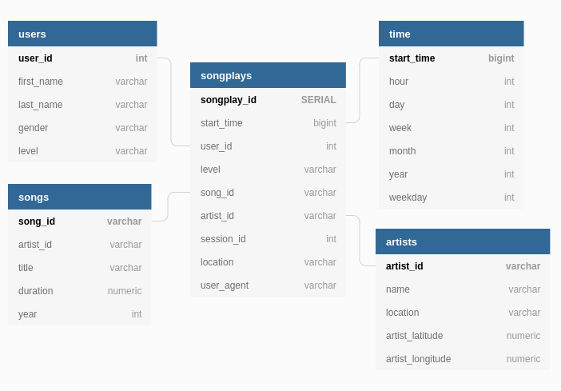

# Postgres-ETL or SEP: Sparkify ETL Pipeline
SEP is a project for an imaginary startup called Sparkify. This project creates a database based on a star schema to allow analysts to be able to run fast, simplifie, intuitive queries to answer their questions. Star schema format ensures data integrity, as attribute fields do not appear in more than one table.

# SEP files and tables:
the SEP project includes seven files but three files are required to run the script
* sql_queries.py - Necessary - contains all sql queries.
* create_tables.py - Necessary - drops and creates tables.

* etl.py - Necessary - reads and processes all files and loads them into tables.
* etl.ipynb - reads and processes a single file and loads the data into tables.
* test.ipynb - displays the first few rows of each table.
* see_DataSet.ipynb
* README.md

# How to create the database using SEP:
First, we need to create the database.
`python create_tables.py`
Second, run:
`python3 etl.py`

# Prerequisites
All libraries you need to install:

* psycopg2
* ipython-sql
* pandas
* numpy

